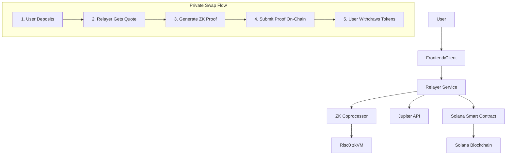

# Private Swap Integration Guide

## 🌟 Overview

This repository contains a complete **private swap system** that combines three key components:

1. **🏛️ Smart Contract** (`contracts/`) - Solana Anchor program for secure token vaults
2. **🔐 ZK Coprocessor** (`zk-coprocessor/`) - Risc0-based zero-knowledge proof generation  
3. **🔄 Relayer Service** (`relayer/`) - HTTP API for orchestrating private swaps

## 🏗️ Architecture



## 🔄 How It Works

### **The Private Swap Process:**

1. **Deposit Phase**
   - User deposits tokens into the vault smart contract
   - Tokens are held securely by a Program Derived Address (PDA)

2. **Intent Submission**  
   - User submits swap intent to relayer with desired token pair and amount
   - Relayer gets the best route from Jupiter aggregator

3. **ZK Proof Generation**
   - Relayer generates zero-knowledge proof using Risc0 zkVM
   - Proof validates swap parameters without revealing them on-chain
   - Creates a 32-byte commitment hash

4. **Proof Submission**
   - Relayer submits the ZK proof to the smart contract
   - On-chain proof includes: hash, output token, amount, recipient
   - No actual swap details are revealed publicly

5. **Token Withdrawal**
   - User calls `withdraw()` with their wallet
   - Smart contract validates: proof exists, user is recipient, not executed
   - Tokens are transferred to user's account
   - Proof account is closed to prevent reuse

## 🚀 Quick Start

### **Prerequisites**
- Node.js 18+
- Rust & Cargo
- Solana CLI (optional, for deployment)

### **1. Setup All Components**
```bash
# Make setup script executable and run
chmod +x setup-integration.sh
./setup-integration.sh
```

### **2. Configure Environment**
```bash
# Edit relayer configuration
cp relayer/.env.example relayer/.env
# Add your Solana keypair and RPC endpoint
```

### **3. Run Integration Test**
```bash
# Test all components work together
node integration-test.js
```

### **4. Start Relayer Service**
```bash
cd relayer
npm run dev
```

## 🧪 Testing the Integration

### **Health Check**
```bash
curl http://localhost:3000/health
```

### **Test ZK Proof Generation**
```bash
curl -X POST http://localhost:3000/test-zk \
  -H "Content-Type: application/json" \
  -d '{
    "inputAmount": 1000000,
    "outputAmount": 950000,
    "inputMint": "So11111111111111111111111111111111111111112",
    "outputMint": "EPjFWdd5AufqSSqeM2qN1xzybapC8G4wEGGkZwyTDt1v",
    "recipient": "YOUR_WALLET_ADDRESS"
  }'
```

### **Submit Proof to Contract**
```bash
curl -X POST http://localhost:3000/submit-proof \
  -H "Content-Type: application/json" \
  -d '{
    "tokenIn": "So11111111111111111111111111111111111111112",
    "tokenOut": "EPjFWdd5AufqSSqeM2qN1xzybapC8G4wEGGkZwyTDt1v", 
    "amountIn": 1000000,
    "amountOut": 950000,
    "user": "USER_WALLET_ADDRESS"
  }'
```

## 📋 API Endpoints

### **GET /health**
- Health check endpoint
- Returns service status and configuration

### **POST /quote**
- Get Jupiter swap quote
- Body: `{ tokenIn, tokenOut, amountIn, slippage }`

### **POST /submit-proof**  
- Generate ZK proof and submit to contract
- Body: `{ tokenIn, tokenOut, amountIn, amountOut, user }`

### **POST /test-zk**
- Test ZK proof generation only
- Body: `{ inputAmount, outputAmount, inputMint, outputMint, recipient }`

## 🔧 Component Details

### **Smart Contract (`contracts/`)**
```rust
// Main functions
initialize_vault()  // Create secure vault
deposit(amount)     // User deposits tokens  
submit_proof(...)   // Relayer submits ZK proof
withdraw()          // User withdraws tokens
```

**Key Features:**
- ✅ PDA-based vault authority
- ✅ Recipient validation  
- ✅ Double-spend prevention
- ✅ Account cleanup after withdrawal

### **ZK Coprocessor (`zk-coprocessor/`)**
```rust
// Proof generation
INPUT: SwapParams { input_amount, output_amount, input_mint, output_mint, recipient }
OUTPUT: 32-byte SHA256 proof hash
```

**Security Properties:**
- ✅ Validates swap parameters
- ✅ Generates deterministic proof hash
- ✅ Prevents invalid swap execution

### **Relayer Service (`relayer/`)**
```typescript
// Core functions
generateZkProof()    // Call ZK coprocessor
getJupiterQuote()    // Get swap quotes
submitProofToChain() // Submit to contract
```

**Capabilities:**
- ✅ Jupiter integration for best routes
- ✅ Automated ZK proof generation  
- ✅ Smart contract interaction
- ✅ REST API for clients

## 🔒 Security Features

### **Privacy Protection**
- 🛡️ **Transaction Privacy**: Swap amounts hidden on-chain
- 🛡️ **Front-running Protection**: MEV bots can't extract value
- 🛡️ **Parameter Binding**: ZK proof commits to exact swap terms

### **Security Validations**
- 🔐 **Recipient Authentication**: Only intended recipient can withdraw
- 🔐 **Double-spend Prevention**: Each proof usable only once  
- 🔐 **PDA Authority**: Secure token custody via program addresses
- 🔐 **Parameter Validation**: ZK circuit validates all inputs

## 🚀 Deployment

### **Smart Contract**
```bash
cd contracts
# Build the contract
./build-fix.ps1  # Windows
# or cargo build --release  # Linux/Mac

# Deploy to devnet
solana program deploy target/deploy/private_swap_vault.so
```

### **Relayer Service**
```bash
cd relayer
npm run build
npm start
```

### **Production Environment Variables**
```bash
# Required for production
RPC_ENDPOINT=https://api.mainnet-beta.solana.com
PROGRAM_ID=YOUR_DEPLOYED_PROGRAM_ID
RELAYER_PRIVATE_KEY=[your,secret,key,array]
```

## 🐛 Troubleshooting

### **Common Issues**

**ZK Coprocessor Build Fails**
```bash
# Install Risc0 toolchain
curl -L https://risczero.com/install | bash
rzup install
```

**IDL Not Found**
```bash
cd contracts
./build-fix.ps1  # Build contracts first
```

**Relayer Connection Issues**
```bash
# Check environment variables
cat relayer/.env
# Verify RPC endpoint is accessible
curl https://api.devnet.solana.com -X POST -H "Content-Type: application/json" -d '{"jsonrpc":"2.0","id":1,"method":"getHealth"}'
```

**Proof Validation Errors**
- Ensure ZK coprocessor generates exactly 32-byte hashes
- Verify recipient address matches user wallet
- Check proof hasn't been used already

## 📈 Performance

| Component | Typical Latency | Notes |
|-----------|----------------|-------|
| ZK Proof Generation | 1-3 seconds | Depends on hardware |
| Contract Interaction | 0.5-1 second | Network dependent |
| Jupiter Quote | 0.2-0.5 seconds | API response time |
| **Total Swap Time** | **2-5 seconds** | **End-to-end** |

## 🛣️ Roadmap

### **Short Term**
- [ ] Frontend integration examples
- [ ] Batch proof submissions
- [ ] Performance optimizations

### **Long Term**  
- [ ] Recursive ZK proofs for batching
- [ ] On-chain ZK verification
- [ ] Cross-chain private swaps
- [ ] Enhanced privacy (token hiding)

## 📞 Support

For issues and questions:

1. **Check the troubleshooting section above**
2. **Run the integration test:** `node integration-test.js` 
3. **Check component logs** for specific error messages
4. **Verify environment configuration** in `relayer/.env`

## 🎉 Success!

If you see all green checkmarks ✅ in the integration test, your private swap system is ready for use!

**Next Steps:**
- Build a frontend interface
- Deploy to mainnet for production use
- Implement additional privacy features
- Scale with batch processing

---

*Built with ❤️ using Solana, Anchor, Risc0, and Jupiter* 