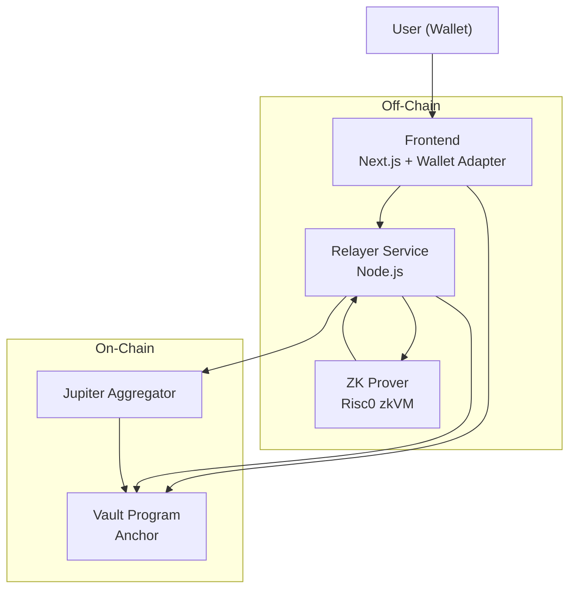
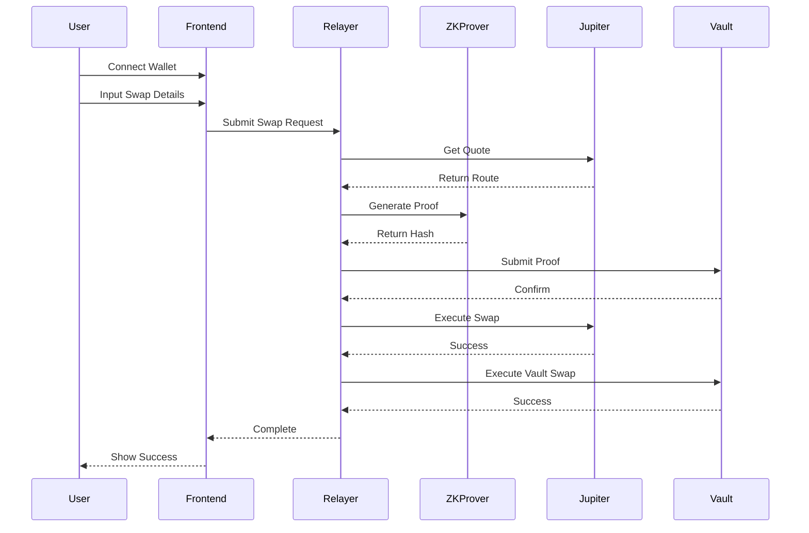
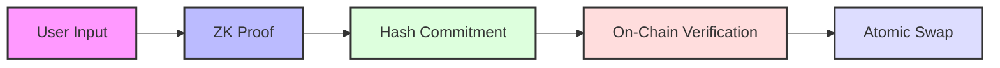

# System Architecture

## Component Diagram

```mermaid
graph TB
    User["User (Wallet)"]
    Frontend["Frontend<br/>Next.js + Wallet Adapter"]
    Relayer["Relayer Service<br/>Node.js"]
    Vault["Vault Program<br/>Anchor"]
    Jupiter["Jupiter Aggregator"]
    ZKProver["ZK Prover<br/>Risc0 zkVM"]
    
    User --> Frontend
    Frontend --> Relayer
    Frontend --> Vault
    
    Relayer --> Jupiter
    Relayer --> ZKProver
    Relayer --> Vault
    
    Jupiter --> Vault
    ZKProver --> Relayer

    subgraph "On-Chain"
        Vault
        Jupiter
    end
    
    subgraph "Off-Chain"
        Frontend
        Relayer
        ZKProver
    end

```

## Flow Diagram

```mermaid
sequenceDiagram
    participant User
    participant Frontend
    participant Relayer
    participant ZKProver
    participant Jupiter
    participant Vault

    User->>Frontend: Connect Wallet
    User->>Frontend: Input Swap Details
    Frontend->>Relayer: Submit Swap Request
    
    Relayer->>Jupiter: Get Quote
    Jupiter-->>Relayer: Return Route
    
    Relayer->>ZKProver: Generate Proof
    ZKProver-->>Relayer: Return Hash
    
    Relayer->>Vault: Submit Proof
    Vault-->>Relayer: Confirm
    
    Relayer->>Jupiter: Execute Swap
    Jupiter-->>Relayer: Success
    
    Relayer->>Vault: Execute Vault Swap
    Vault-->>Relayer: Success
    
    Relayer-->>Frontend: Complete
    Frontend-->>User: Show Success
```

## Security Flow

```mermaid
graph LR
    A["User Input"] --> B["ZK Proof"]
    B --> C["Hash Commitment"]
    C --> D["On-Chain Verification"]
    D --> E["Atomic Swap"]
    
    style A fill:#f9f,stroke:#333,stroke-width:2px
    style B fill:#bbf,stroke:#333,stroke-width:2px
    style C fill:#dfd,stroke:#333,stroke-width:2px
    style D fill:#fdd,stroke:#333,stroke-width:2px
    style E fill:#ddf,stroke:#333,stroke-width:2px
``` 